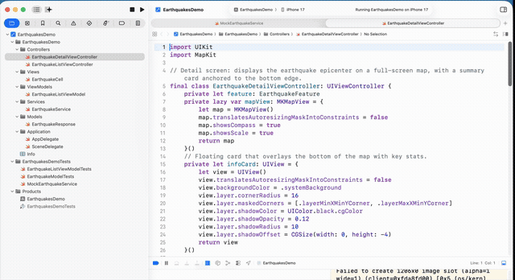

# EarthquakesDemo

> A clean MVVM iOS demo that fetches and displays significant earthquakes (magnitude ≥ 7) from the [USGS GeoJSON API](https://earthquake.usgs.gov/fdsnws/event/1/).

## Preview

| App Preview (Simulator) | Unit Tests |
|:---:|:---:|
|  |  |

## Architecture

The project follows **MVVM** with clear separation between UI, business logic, and networking.

```
EarthquakesDemo/
├── Application/
│   ├── AppDelegate.swift          # App entry point & scene configuration
│   └── SceneDelegate.swift        # Window / root view controller setup
├── Models/
│   └── EarthquakeResponse.swift   # Codable GeoJSON models (Feature, Properties, Geometry)
├── Services/
│   └── EarthquakeService.swift    # EarthquakeServiceProtocol + live USGS API implementation
├── ViewModels/
│   └── EarthquakeListViewModel.swift   # State machine (idle/loading/loaded/error) + business rules
├── Controllers/
│   ├── EarthquakeListViewController.swift   # Table view, loading & error UI
│   └── EarthquakeDetailViewController.swift # Map + info card for a single earthquake
├── Views/
│   └── EarthquakeCell.swift       # Custom UITableViewCell with magnitude badge & tsunami tag
└── Info.plist

EarthquakesDemoTests/
├── EarthquakeListViewModelTests.swift   # VM state transitions, severity threshold, sorting
├── EarthquakeModelTests.swift           # GeoJSON decoding & geometry convenience accessors
└── MockEarthquakeService.swift          # Mock service + factory helpers for tests
```

## File Guide

| File | Responsibility |
|------|----------------|
| `AppDelegate.swift` | Standard `UIApplicationDelegate` bootstrap. |
| `SceneDelegate.swift` | Sets up the `UIWindow` and root `UINavigationController`. |
| `EarthquakeResponse.swift` | Decodable structs matching USGS GeoJSON. Provides derived `longitude`, `latitude`, `depthKm`, and `date`. |
| `EarthquakeService.swift` | Defines `EarthquakeServiceProtocol`. Live implementation queries `https://earthquake.usgs.gov/fdsnws/event/1/query` (2023, magnitude ≥ 7) and skips local cache. |
| `EarthquakeListViewModel.swift` | Owns all list-screen logic. Exposes `EarthquakeListState` (`idle → loading → loaded/error`) via `onStateChange` closure. Sorts results newest-first and exposes a `isSevere` helper (≥ 7.5). |
| `EarthquakeListViewController.swift` | Binds to `EarthquakeListViewModel`, renders states (spinner, table, error label), and pushes `EarthquakeDetailViewController` on selection. |
| `EarthquakeDetailViewController.swift` | Full-screen `MKMapView` with a bottom info card showing magnitude (red when severe), depth, and date. |
| `EarthquakeCell.swift` | Reusable cell with a circular magnitude badge (blue / red), place, date, and optional tsunami warning label. |
| `EarthquakeListViewModelTests.swift` | Tests severity threshold (7.5), state transitions, duplicate-load guard, sorting, and error propagation. |
| `EarthquakeModelTests.swift` | Tests real GeoJSON decoding: feature count, magnitude, place, timestamp-to-date conversion, nullable alert, geometry accessors. |
| `MockEarthquakeService.swift` | Test-double conforming to `EarthquakeServiceProtocol`. Includes `EarthquakeFeature.make(...)` factory for concise test data. |

## Requirements

- iOS 15+
- Xcode 14+
- Swift 5.7+

## Getting Started

1. Open `EarthquakesDemo.xcodeproj` in Xcode.
2. Select a simulator or device and press **Cmd + R** to run.
3. Press **Cmd + U** to execute unit tests.

## License

MIT
